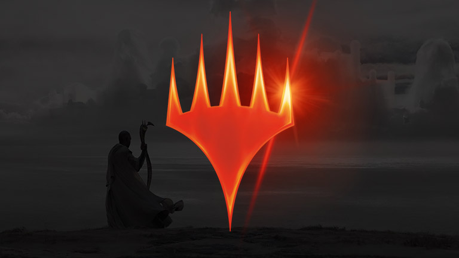
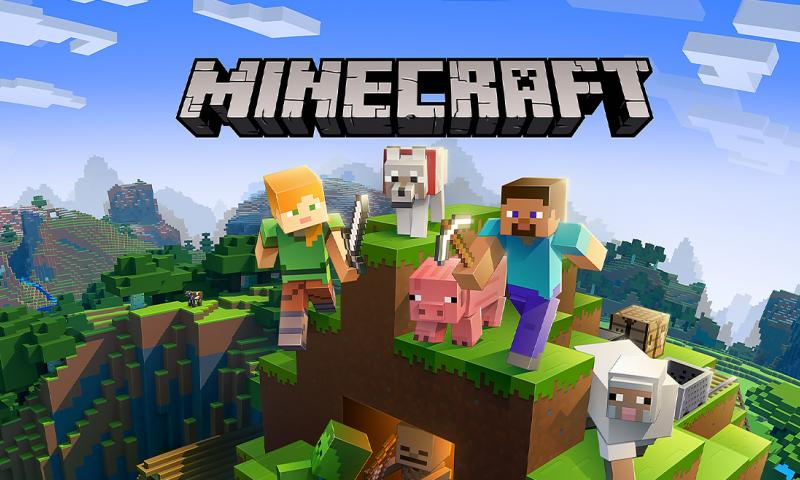

# **Chris Baucke's User Page**
> All we have to decide is what to do with the time that is given to us.
\- J.R.R. Tolkien

`System.out.println("Hello!");` My name is Chris Baucke, and I am a junior in Warren College majoring in computer science. Here is my dog, [Grace](Grace.jpg), and my cat, [Charlie](Charlie.jpg).

I am very excited to take this course! By the end of the quarter, I hope to:
- [ ] Become completely familiar with GitHub/git
- [ ] Get some experience with working on a programming project in a group
- [ ] Improve my coding habits, such as better documentation
- [x] Learn what qualities a good software engineer should have

## Me as a Programmer
My favorite programming language is Java, although I am also comfortable in all of the following languages:
- C
- C++
- JavaScript
- ARM

After graduating, my top career fields (in ascending order) would be:
1. AI/Machine Learning
2. Cyber Security
3. Game Development

Earlier this year, I participated in my first hackathon at SD Hacks, and my team placed in the top 25 teams. You can view our project [here](https://devpost.com/software/rally-972jpc). I had a great time and definitely plan on doing more hackathons in the future.

## My Hobbies
In my spare time, I enjoy:
- Reading: During the pandemic, I have read books such as *Jurassic Park* and *Dune*

- Playing soccer: I have not played in a while, but I have played recreational soccer for more than 10 years, usually as a left midfielder or forward

- Playing *Magic: The Gathering*: I enjoy playing commander in person and historic online

- Playing video games: Recently, I have been playing Minecraft and CS:GO
